# Debian with Automated Snapper Rollbacks

This is a short tutorial about setting up a Debian linux system with automated BTRFS snapshots of the system and easy rollback to previous auto-generated snapshots. The tutorial is inspired by the [SpiralLinux](https://github.com/SpiralLinux/SpiralLinux-project) distribution, which configures this automatically upon install.

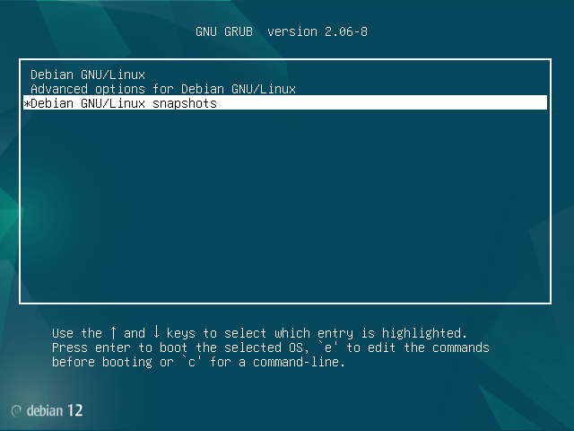
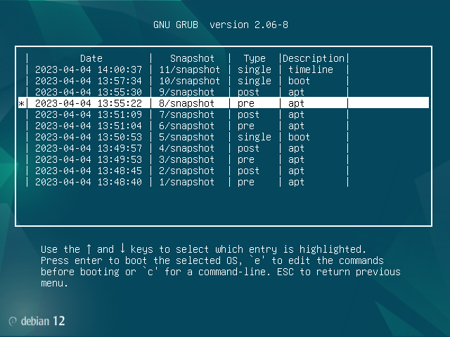

# Motivation

At the time of writing, Debian by default will install using an `ext4` file system. This works fine for the kind of features that were envisioned for file systems at the time unixes were born, but in today's landscape, other file systems can offer many additional features that come very handy for desktop usage.

Since the introduction of `ext`-type systems, there have been many advances in the field as implemented in systems such as ZFS or BTRFS, which bring functionalities like copy-on-write (COW), automatic snapshots achieved through the COW system, automated compression, encryption, among others.

In particular, for desktop usage, one would typically want to have a way of rolling back some software update or going back to how the computer was a few days ago. This is now possible to do through automated snapshots (which thanks to the COW system, are instantaneous to generate and do not take much extra space), and is implemented automatically in other distributions such as OpenSuSe, but in Debian, it takes a few more manual steps to get it working.

Thanks to software like [snapper](https://github.com/openSUSE/snapper), [grub-btrfs](https://github.com/Antynea/grub-btrfs) and [snapper-rollback](https://github.com/jrabinow/snapper-rollback), it's possible to have the same system in Debian in which:

* Automated file system snapshots are generated every time `apt` or similar is executed.
* Snapshots are also generated daily and the last N-selected days of snapshots kept at any given time.
* The boot menu offers to boot into any of the available snapshots.
* The system can be rolled back to a previous snapshot, and this can be done while booting from an older snapshot too.

# Overview

This guide outlines the necessary steps to configure the kind of system described above using the combination of `snapper` + `snapper-rollback` + `grub-btrfs`.

* [A premier about BTRFS](https://github.com/david-cortes/snapper-in-debian-guide#a-premier-about-btrfs)
* [Installing Debian with a BTRFS partition](https://github.com/david-cortes/snapper-in-debian-guide#installing-debian-with-a-btrfs-partition)
* [Creating required BTRFS subvolumes](https://github.com/david-cortes/snapper-in-debian-guide#creating-required-btrfs-subvolumes)
* [Installing and configuring software for snapshots and rollbacks](https://github.com/david-cortes/snapper-in-debian-guide#installing-and-configuring-software-for-snapshots-and-rollbacks)
* [Performing a system rollback](https://github.com/david-cortes/snapper-in-debian-guide#performing-a-system-rollback)
* [Snapshots for the `/home` subvolume](https://github.com/david-cortes/snapper-in-debian-guide#snapshots-for-the-home-subvolume)

# A premier about BTRFS

The BTRFS file system differs a bit from the paradigms that previous generations of file systems followed. One can read the [Wikipedia article about it](https://en.wikipedia.org/wiki/Btrfs) for more information. A few points for the purposes of this guide:

* It uses the concept of _subvolumes_, which are similar to disk partitions. Multiple subvolumes can be generated inside a single BTRFS partition, and in many ways they work the same as partitions (e.g. one can delete/clone a subvolume without touching the rest of the system, have specific options for it like compression or no compression, make snapshots, etc.), but with the added benefit that subvolumes within the same volume do not introduce a space limit barrier, unlike hard partitions. Just like with partitions, these subvolumes can be referenced in the file `/etc/fstab` in order to mount them at the desired system paths with the desired options.
* Internally, BTRFS can leverage compression algorithms like ZSTD or LZMA, which allow decreasing the space that files take on disk. In today's landscape, reading contents from a disk file is many orders of magnitude slower than doing operations with them on RAM, thus compression can make reading disk files faster, as reading and decompressing a smaller chunk of memory from RAM is oftentimes faster than reading the whole content from disk. This however will lead to misleading reporting of space taken.
* It can use copy-on-write for handling file writes - meaning: it's possible to obtain a previous version of a file by unrolling the changes that were done to it, if these files are represented by incremental changes. And note that, if only changes are stored, having multiple versions of files available doesn't necessarily take as much space as if independent copies were stored. This is not free however as it requires extra RAM when doing disk operations, and for optimal performance, requires disk de-fragmentation like in older systems.

In order to enable or disable options like compression in a BTRFS subvolume, one needs to modify their mount options in the file `/etc/fstab`. For example, upon install, debian might mount the root BTRFS volume with a line like this:
```
UUID=<device id> /    btrfs    defaults,subvol=@rootfs    0    0
```

Key there is the part where it says `defaults,subvol=@rootfs`. One can modify this chunk right there to enable further features - e.g.:
```
UUID=<device id> /    btrfs    defaults,compress=zstd,autodefrag,subvol=@rootfs    0    0
```

(Note: only 1 space or tab is required between chunks in the file, the rest are just for visual aid)

A very good source of information about handling of BTRFS systems, options, commands, etc. is the [Arch wiki](https://wiki.archlinux.org/title/Btrfs).

# Installing Debian with a BTRFS partition

During installation of Debian, be sure to create a **single** partition of BTRFS type for your system **PLUS** a separate partition for `/boot`. The boot partition doesn't need to be BTRFS, and only requires a small size to work (1GB will suffice as of 2023). You'll probably want another partition for SWAP too.

It's pretty straight-forward to do this with the installer, but here are some screenshots in case it's not clear. Note that you'll probably want to set up a larger SWAP partition than what's shown in the screenshots.

**IMPORTANT:** these screenshots depict the process assuming the system is booting in legacy BIOS mode. For UEFI systems, you'll also need a `/boot/efi` entry (screenshots about it to come in the future).

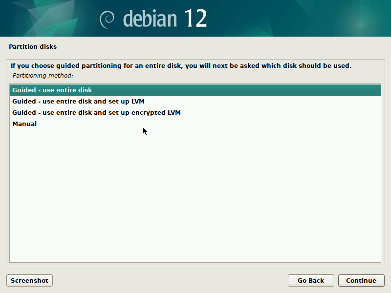

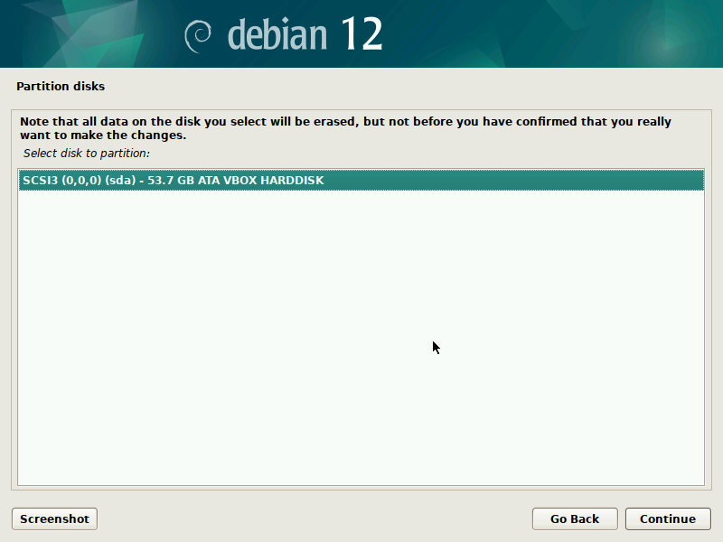

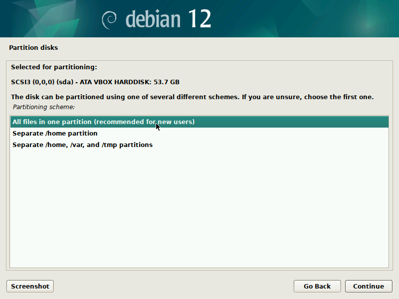

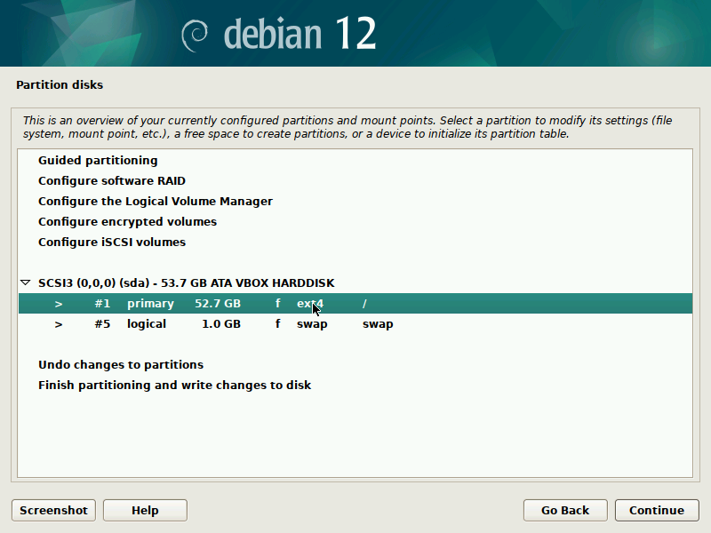

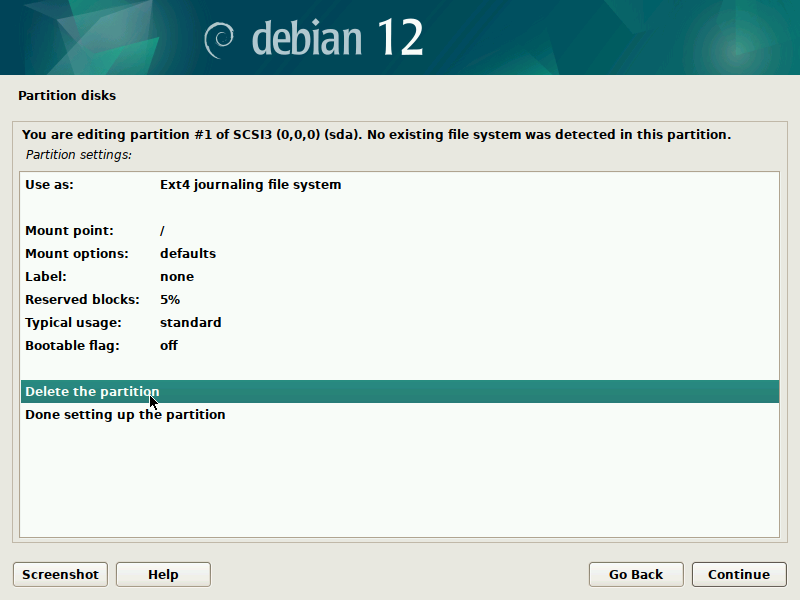

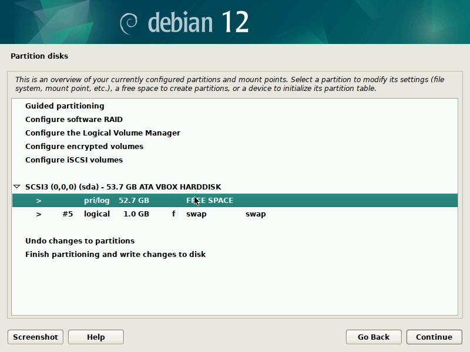

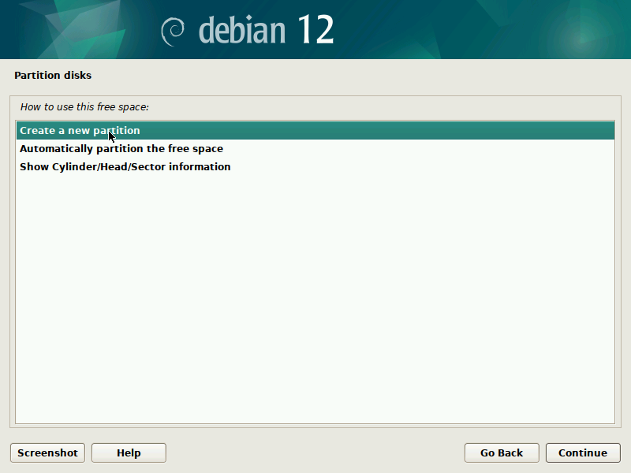

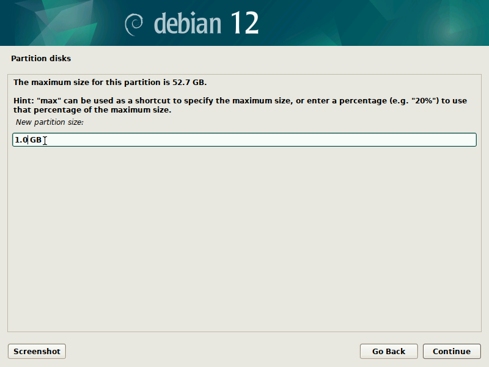

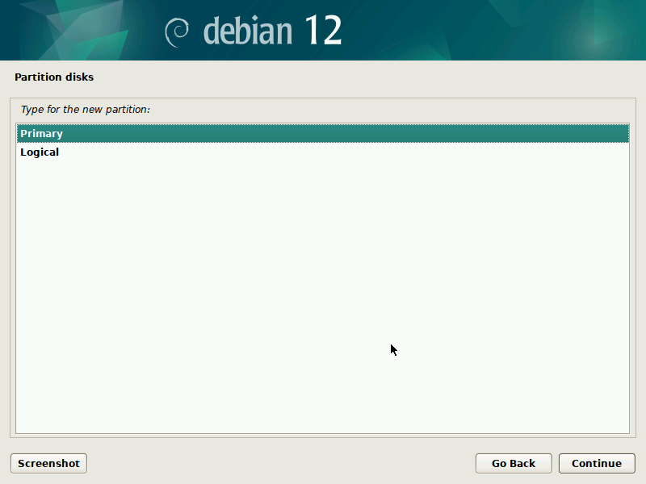

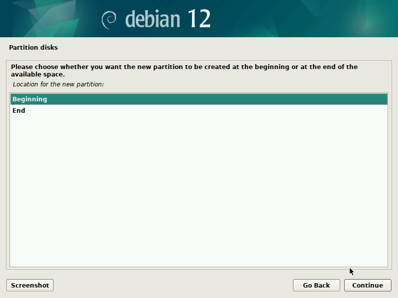

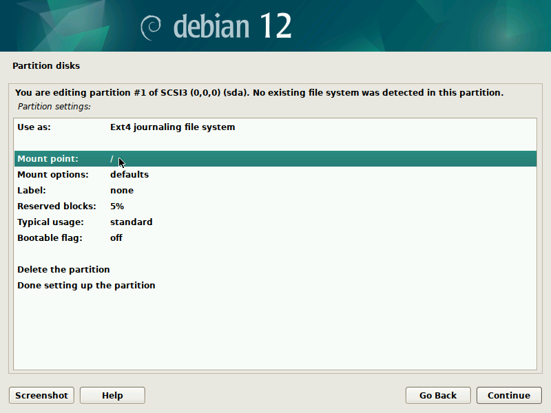

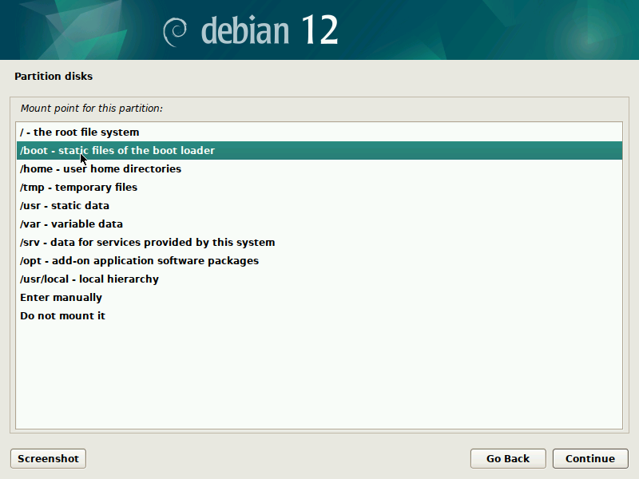

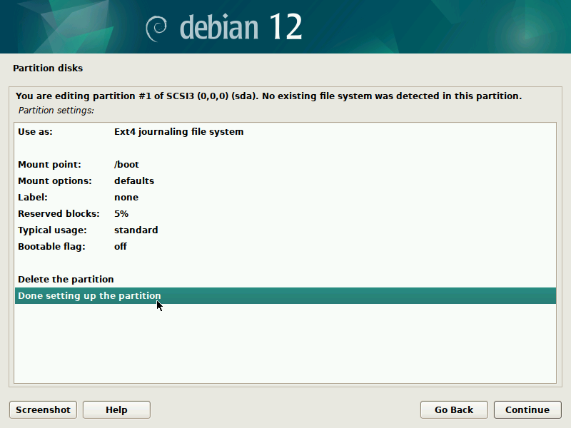

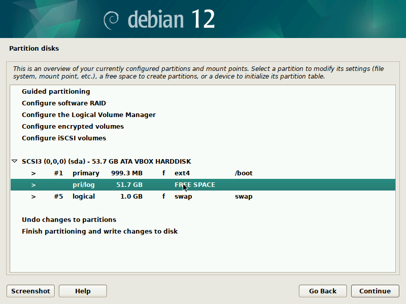

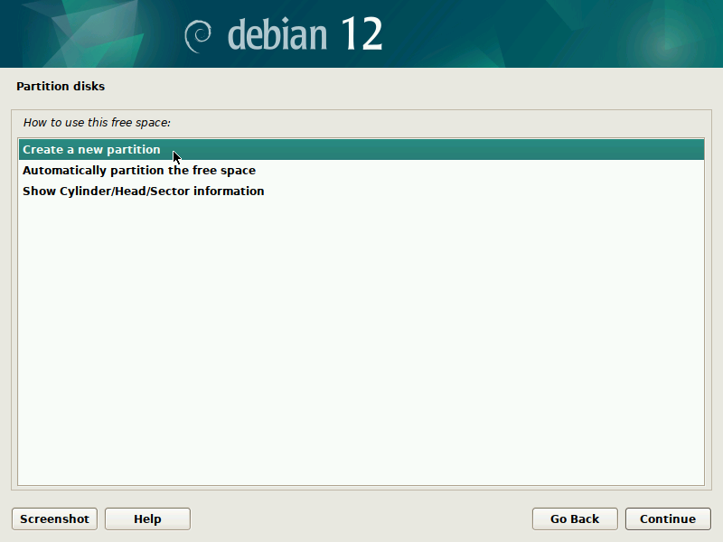

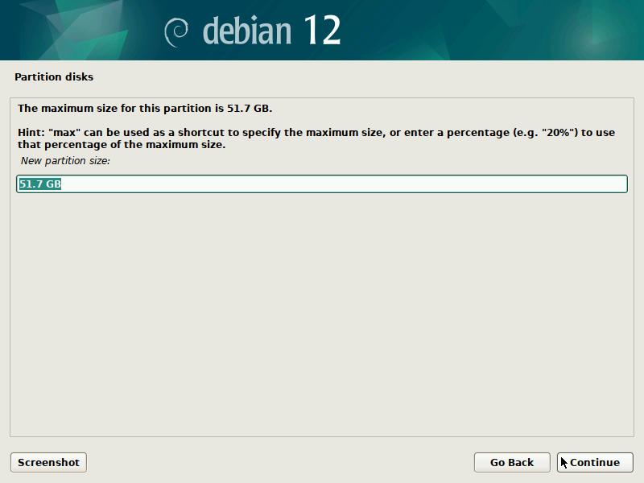

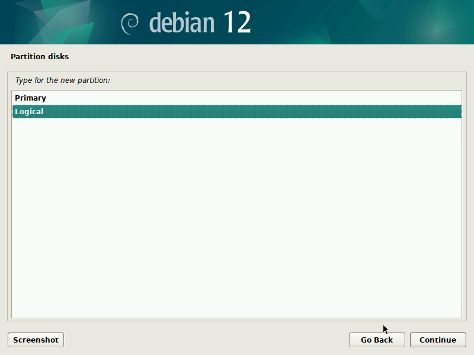

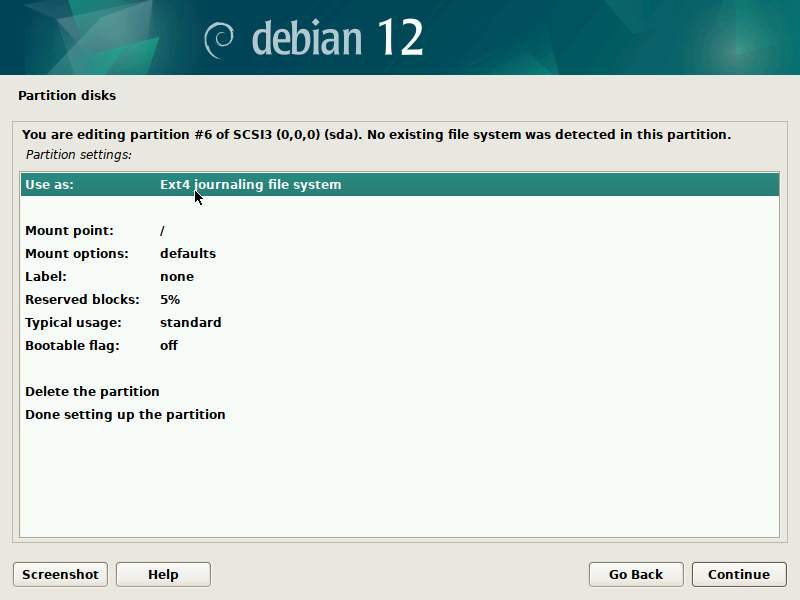

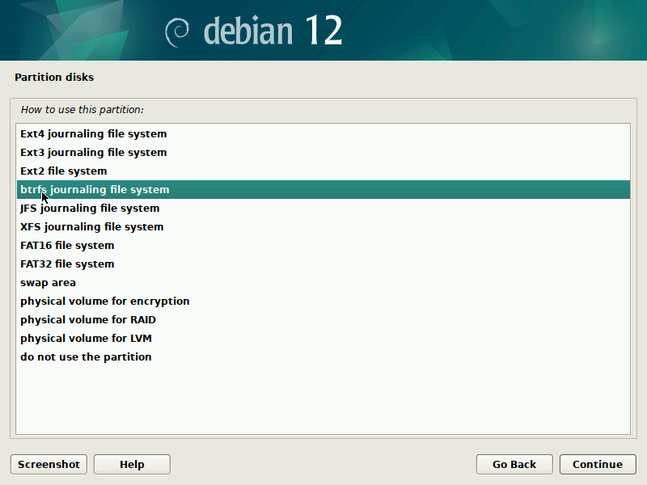

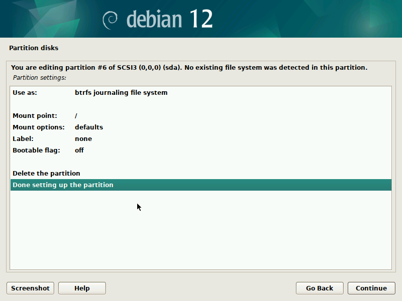

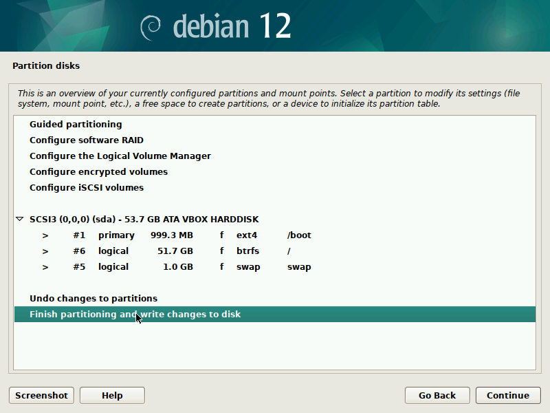


Optionally, you might also want to enable encryption. Note that in such case, you'll probably want to put both the BTRFS partition and the SWAP partition under the same encrypted logical volume. The installer's UI is rather cumbersome for such configurations, but some google searches might help.

See this longer step-by-step guide for more advanced configurations through the installer, including creating an encrypted volume for both the BTRFS and SWAP partitions together:
https://unix.stackexchange.com/a/577765/342846

# Creating required BTRFS subvolumes

## Prequesitive: install `sudo` and necessary software

This guide uses `sudo` for the rest of the commands that it suggests. `sudo` should come by default in a debian install, but **if you added a root password in the installer**, your user will not be able to use `sudo` by default.

Thus, as a first step, configure `sudo` for your user (**warning:** these instructions sketch an "unsafe" way of doing it - one can also use the `sudoers` user group):

* Log in as the root user by issuing:
```shell
su
```
(then enter the root password)
* Add a line to the file `/etc/sudoers` giving your user all the `sudo` permissions:
```shell
printf "<your user>   ALL=(ALL:ALL) ALL\n" >> /etc/sudoers
```
(replace `<your user>` with the name of your linux user)
* Exit from the `su` session:
```shell
exit
```
* Now you can use `sudo` with your user. Try the following in order to update the package cache:
```shell
sudo apt-get update
```
* If it doesn't succeed, you might manually need to modify the file `/etc/apt/sources.list` to _not_ use the debian installation CD/DVD and instead use an internet repository. It's highly recommended that you google about it if you aren't familiar with it, but as a quick note, the following will do:
    * Edit the file with your favorite text editor (note that it requires `sudo` permissions to overwrite the file):
    ```shell
    sudo nano /etc/apt/sources.list
    ```
    * Comment out any lines starting with `cdrom`, by putting a `#` character at the beginning of such lines.
    * Add a line with the debian main repository (for better results, replace "stable" with the name of the debian release - e.g. "bookworm", "trixie", "forky", etc.):
    ```
    deb http://deb.debian.org/debian/ stable main
    ```
    * Optionally, if you want non-Stallman-approved software, you can add additional parts of the repository there - make the line like this instead:
    ```
    deb http://deb.debian.org/debian/ stable main contrib non-free non-free-firmware
    ```
    * Save the file (Ctrl+O if you are using `nano` to edit it) and try the command again:
    ```shell
    sudo apt-get update
    ```

Now that you've configured `sudo` and refreshed the repositories cache, you'll want to install a few key software packages for the rest of this guide:
```shell
sudo apt-get install btrfs-progs python3-btrfsutil gawk inotify-tools make build-essential git
```

_Note: for this section, you only need `btrfs-progs`, but for the following sections you'll also need the rest in order to install `grub-btrfs` and `snapper-rollback`._

## Required structure

As a preliminary step, one can read through the [Arch wiki](https://wiki.archlinux.org/title/Snapper#Suggested_filesystem_layout) for a suggested layout and instructions for how to accomplish things with BTRFS and snapper.

For the software that this guide uses, you might or might not follow the Arch wiki suggestions, but at the bare minimum, you'll need to create separate BTRFS subvolumes or separate partitions for these key system paths, and manually add them to your `/etc/fstab` file:

* `/var/log` - this is required (with write permissions) in order to boot into read-only snapshots through `grub-btrfs`.
* `/home` - this is required (with write permissions) in order to boot into typical desktop environments like KDE plasma.
* `/boot` (and perhaps `/boot/efi` if encrypted) - this is required also from `grub-btrfs` but should already have been set up by the debian installer and should already be in your /`etc/fstab` if you followed the screenshots from the previous section.

**Optionally** but highly recommended, you might want to add:

* `/tmp` - you don't want to be snapshotting temporary files.
* If you use virtualization software such as docker, virt manager, virtualbox, etc. you will probably want to put their files under separate subvolumes too, or perhaps symlink the paths where they put files to a different non-BTRFS partition. These are paths like `/var/lib/libvirt`, `/var/lib/docker`, or `/home/<your user>/VirtualBox\040VMs`. Note that for docker in specific (which already does COW for their images), you'll need some additional configurations - see [this post](https://linuxconfig.org/how-to-move-docker-s-default-var-lib-docker-to-another-directory-on-ubuntu-debian-linux) for more info.
* If you use some programming language like Python / R / etc., you probably wouldn't want all of their user-installed environments and libraries to be put into your snapshotted subvolume either.

## Mounting the volume under `/btrfsroot`

(Note: this name `btrfsroot` is rather unorthodox but is what `snapper-rollback` uses by default)

As a first step, you'll need to add the logical volume where your BTRFS subvolumes are going to be placed under a separate mount point that will be configured for `snapper-rollback` to use later on.

* First create the mounting path as named above:
```shell
sudo mkdir -p /btrfsroot
```
* Find out what's the ID or the name of your main partition as used by `fstab`. It's typically something like `/dev/sda1` or `/dev/nvme0n1p1`; or if using an encrypted volume, something like `/dev/mapper/lvm0-main`. To find out:
```shell
df --output=source / | tail -n 1
```
(you migh want to assign that name to some environment variable for the rest of this guide)
* Now put what BTRFS calls subvolume id=5 there:
```shell
printf "$(df --output=source / | tail -n 1) /btrfsroot    btrfs    defaults,subvolid=5    0    0\n" | sudo tee -a /etc/fstab
```
* Let your system reload the partition structure after editing `/etc/fstab`
```shell
sudo mount /btrfsroot
```
(ignore the warning message that you'll get about `systemctl daemon-reload`. Or issue the command in question from the warning if you want)

## Creating the structure

_Note: the `@` in the subvolumes is just a naming convention. One can name the subvolumes differently if needed._

([Another similar guide with more details](https://www.jwillikers.com/btrfs-snapshot-management-with-snapper))

### `/home`

**IMPORTANT!!! This guide is for Debian, which names the root subvolume as '@rootfs'. Other systems like Arch name it just '@'. Don't use '@rootfs' if that's not how your distribution's boot configuration names it.**

It's a bit complicated to move `/home` and its contents into a separate subvolume in a system that's already running. The following might nevertheless help **assuming that this is a single-user machine**:

* Create a subvolume for `/home`:
```shell
sudo btrfs subvol create /btrfsroot/@home
```
* Shallow-copy your current home directory there:
```shell
sudo cp -R --reflink=always /home/$(whoami) /btrfsroot/@home
```
* Give it the right permissions and ownership for your user:
```shell
sudo chown -R $(whoami):$(whoami) /btrfsroot/@home/$(whoami)
```
* Add it to `/etc/fstab`:
```shell
printf "$(df --output=source / | tail -n 1) /home    btrfs    defaults,subvol=@home    0    0\n" | sudo tee -a /etc/fstab
```
* Reboot the system:
```shell
sudo shutdown -r now
```
(note: you might also do it through the desktop environment, or with `reboot` or `systemctl reboot` depending on OS version)
* After booting back and logging in again into the **new** subvolume used as home, remove the old `/home` files that are not going to be used (we now have the copy generated earlier):
```shell
sudo rm -R /btrfsroot/@rootfs/home/$(whoami)
```

_Note: The same trick can also be used for other user-owned paths that you might want to transfer to a separate subvolume, such as `/home/${USER}/anaconda3` if you use Anaconda. You won't need a restart for it though._

### Other subvolumes

One can use the same instructions above without the change in ownership in order to swap more system paths to their own subvolume. Might not need to restart the computer for it depending on the path.

In order to put `/var/log` into a separate subvolume (required by `grub-btrfs`):

* Create a subvolume for it:
```shell
sudo btrfs subvol create /btrfsroot/@var@log
```
* Optionally but highly recommended, shallow-copy the current contents there:
```shell
sudo cp -RT --reflink=always /var/log /btrfsroot/@var@log
```
(ignore the errors)
* Add this to your fstab:
```shell
printf "$(df --output=source / | tail -n 1) /var/log    btrfs    defaults,subvol=@var@log    0    0\n" | sudo tee -a /etc/fstab
```
* Remount:
```shell
sudo systemctl daemon-reload
sudo mount /var/log
```
* Remove the old contents:
```shell
sudo rm -rf /btrfsroot/@rootfs/var/log/*
```

You might want to repeat the process for `/tmp`, but **note that it might require a computer restart** instead of a simple remount:

```shell
sudo btrfs subvol create /btrfsroot/@tmp
sudo cp -RT --reflink=always /tmp /btrfsroot/@tmp
printf "$(df --output=source / | tail -n 1) /tmp    btrfs    defaults,subvol=@tmp    0    0\n" | sudo tee -a /etc/fstab
sudo shutdown -r now
## <<< restart >>>
sudo rm -rf /btrfsroot/@rootfs/tmp/*
sudo rm -rf /btrfsroot/@rootfs/tmp/.*
# (ignore the error message after the last command)
```

**************
By this point, your file `/etc/fstab` should now have separate BTRFS subvolumes with the following entries and paths:

* `subvolid=5` -> `/btrfsroot`
* `subvol=@home` -> `/home`
* `subvol=@var@log` -> `/var/log`
* `subvol=@tmp` -> `/tmp` (optional but highly recommended)

# Installing and configuring software for snapshots and rollbacks

As per the beginning of this guide, you'll need the following 3 key pieces of software:

* `snapper`
* `grub-btrfs`
* `snapper-rollback`

And as a reminder, in order to install all of these, you'll first need a few dependencies along the way:
```shell
sudo apt-get install btrfs-progs python3-btrfsutil gawk inotify-tools make build-essential git
````

## 1. Snapper

`snapper` itself can be easily installed from the debian main repository:

```shell
sudo apt-get install snapper
```

You might perhaps also want `snapper-gui` (note that you'll need to execute it as root in order for it to show you non-user partitions), which provides a graphical interface over `snapper`.

After installing snapper, we can now follow [the Arch wiki](https://wiki.archlinux.org/title/Snapper) steps for getting it to take periodic snapshots of the system BTRFS partition (you _might_ optionally configure a similar thing for your `/home` subvolume):

* Monitor and create snapshots from the root of the file system:
```shell
sudo snapper -c root create-config /
```
* The default for `snapper` is to put the snapshots it takes under a folder named `/.snapshots` under the same path that it is snapshotting. In our case, we'll want that to be under a different BTRFS subvolume. **If you already had snapshots**, you'll need to remove them following [the Arch wiki](https://wiki.archlinux.org/title/Snapper#Suggested_filesystem_layout), or if it doesn't work, then [this guide](https://www.jwillikers.com/btrfs-snapshot-management-with-snapper).
* Now proceed with creating a subvolume for the snapshots:
```shell
sudo btrfs subvol create /btrfsroot/@snapshots
```
* Create a path `/.snapshots` where to mount this new subvolume with the snapshots that it will take:
```shell
sudo mkdir -p /.snapshots
```
* Mount the snapshots subvolume where it needs to be:
```shell
printf "$(df --output=source / | tail -n 1) /.snapshots    btrfs    defaults,subvol=@snapshots    0    0\n" | sudo tee -a /etc/fstab
sudo mount /.snapshots
```

### 1.1 Optional: better snapshot titles

By default, the snapshots that snapper will take after installing or uninstalling packages in Debian will be named as "apt" + pre/post. It's nevertheless possible to have them use more informative names, such as the command that triggered the snapshot creation (e.g. `apt-get install <package>`) by modifying the file `/etc/apt/apt.conf.d/80snapper`.

See this gist for a modification that will make it include the command names:
https://gist.github.com/imthenachoman/f722f6d08dfb404fed2a3b2d83263118

## 2. Grub-BTRFS

`grub-btrfs` is not yet (as of 2023-04) available from the debian main repository, but can be installed from GitHub.

**Be sure to install from the master branch**, as the release-level versions are no longer compatible with the latest debian at the time of writing.

* First clone the repository:
```shell
git clone https://github.com/Antynea/grub-btrfs.git
```
* Now verify that it's possible to build it:
```shell
cd grub-btrfs
sudo make
```
* If that succeeded, then go ahead and install:
```shell
sudo make install
```
* Once installed, enable and start the daemon from this software:
```shell
sudo systemctl enable grub-btrfsd
sudo systemctl start grub-btrfsd
```
* Update grub to use the new config:
```shell
sudo update-grub
```
(_Note: you might get a warning about no snapshots being found. That's fine as there aren't any yet if you followed this guide on a clean system_)

## 3. Snapper-Rollback

Also needs to be installed from Git:
```shell
cd .. # if you were inside the previous git repo
git clone https://github.com/jrabinow/snapper-rollback.git
cd snapper-rollback
sudo cp snapper-rollback.py /usr/local/bin/snapper-rollback
sudo cp snapper-rollback.conf /etc/
```
(**IMPORTANT!!** the readme in that project recommends copying it to `/usr/local/sbin`, while this puts it under `/usr/local/bin`. Reason being: `/usr/local/sbin` might not be added in yout `$PATH` env. variable. Verify that the path where you copy it into is shown among the entries that you see from `echo ${PATH}`)

**Now that it is installed**, you'll need to modify its configuration file (the one that was copied into `/etc/snapper-rollback.conf` in the last command above)

Notice that, if you open the file, there will be a section like the following:
```
# config for btrfs root
[root]
# Name of your linux root subvolume
subvol_main = @
```

Since we are using **Debian**, the main subvolume will be named `@rootfs` instead of `@`. Thus, it's necessary to edit that line to make it look like this:
```
# config for btrfs root
[root]
# Name of your linux root subvolume
subvol_main = @rootfs
```

To do it programmatically:
```shell
sudo sed -i 's/subvol_main = @/subvol_main = @rootfs/g' /etc/snapper-rollback.conf
```

*****************

With these 3 pieces of software already installed, now reboot the machine. Afterwards, **the system should now be fully configured for snapshots and rollbacks**.

# Performing a system rollback

In order to verify that the snapshotting and restoration are working correctly, it's a good idea to try out a rollback.

As a first step, in order to convince yourself that the rollback has been successful, first install some new software that isn't already in the system through something like `apt`, `apt-get`, `aptitude` or similar. For example, if installing debian, it typically doesn't come with the `atop` software, so install it in order to try:
```shell
sudo apt-get install atop
```
(choose a different software if you already have it installed)

Verify that your system can now run the `atop` that you just installed by executing it:
```shell
atop
```
Then exit from the program with Ctrl+C.

Once that is done, notice that your system will have created two snapshots (before/after `apt` command). You can verify this by issuing a command like the following:
```shell
sudo update-grub
```
This time, it should emit some prints about having found those snapshots, which _might_ look like this:
```
...
Found snapshot: <day and time> | @snapshots/2/snapshot | post | apt
Found snapshot: <day and time> | @snapshots/1/snapshot | pre  | apt
...
```
Note that, if `grub-btrfs` is working correctly, it should run `update-grub` automatically after it finds the new snapshots, so this is step is not strictly needed but can give you a visual clue of whether things went smoothly.

Now it should be possible to boot into those snapshots. In particular, the snapshot saying "pre" (number "1" above) should not have `atop` installed. So now restart the computer, and pick this new option in the GRUB menu:


Now choose your first entry that says "pre" in the subsequent menu. **Make a note of which number it was** (here it is number "1"). You will need to remember this number for later:
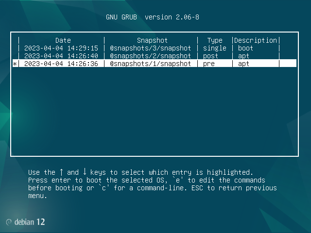

And once inside it, choose the only linux kernel version that it will have:
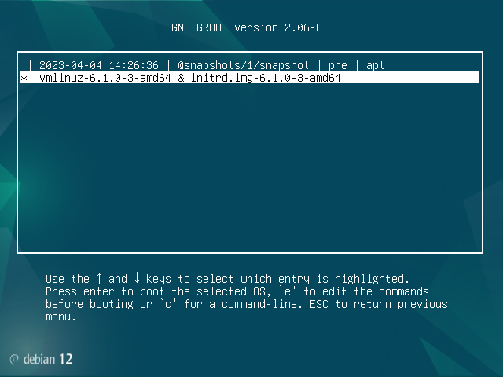

Now you should have booted into a **READ-ONLY** snapshot of your system at the time before `atop` was installed. Verify right there that `atop` is not installed anymore in this snapshot:
```shell
atop
```
(should error out as it won't be installed)
```
bash: atop: command not found
```

Now, before the final rollback, perform a dry-run where you will see the commands that the rollback program will issue. Assuming that the snapshot you want to restore is number "1" (change it to your desired snapshot number otherwise), this will first ask you for a confirmation, and then show what it will execute if you puruse the **real** rollback:
```shell
snapper-rollback 1 --dry-run
```

If everything looks Ok, **now perform the actual rollback:**
```shell
sudo snapper-rollback 1
```

By this point, you can reboot the system - next it starts, it will boot from the previous snapshot that you just restored here when you select the first entry in the GRUB boot menu. Only this time, it will be read+write as usual.

Notice that part of what the command did was to move what's the current snapshot called `@rootfs` to a new snapshot called `@rootfs<timestamp>`, which if following the `fstab` structure of this guide, will be findable under `/btrfsroot`. **This old unused snapshot doesn't have an auto-delete policy** like the other auto-created snapper snapshots, so you will have to delete it manually after having rebooted into the rolled-back system:
```shell
sudo rm -Rf /btrfsroot/$(ls /btrfsroot | grep "^@rootfs[0-9]")
```

**Note:** you can also delete it visually through the software `snapper-gui`, which assuming it was installed (`sudo apt-get install snapper-gui`), can be launched with root priviliges for this operation as follows:
```shell
sudo snapper-gui
```

# Snapshots for the `/home` subvolume

Just like it was done for the root of the file system `/` (subvolume `@rootfs`), it's also possible to let snapper automatically create daily snapshots of the `/home` subvolume and keep the last N of them. There are a couple caveats however:

* Snapshots are create in read-only mode, while typical desktop environments such as KDE plasma are unable to log into a non-writable `/home/<user>` path. Thus, booting into a snapshot of `/home` will first require making it writable, and writable snapshots do not share the same space efficiency optimizations as non-writable ones under a COW system.
* Snapshots of `/home` will not necessarily coincide with snapshots of `/` in terms of the times at which they are taken.
* Using a snapshot of `/home` requires editing the current `fstab` file for it, thus one cannot easily boot into an old snapshot of `/` alongside with an old snapshot of `/home` (as it requires modifying the `fstab` of the snapshot into which you will boot).

It's nevertheless handy to have a back up when things do wrong, even if it's difficult to use.

Steps:

* Let `snapper` manage snapshots for yout `@home` subvolume:
```shell
sudo snapper -c home create-config /home
```
* As before, snapper creates the snapshots under a subfolder `/.snapshots` in the same path that is being snapshotted, which now will be `/home/.snapshots` instead of `/.snapshots`. We'll first need to create yet another subvolume for these snapshots and mount it under the path that snapper will use:
```shell
sudo btrfs subvol create /btrfsroot/@homesnapshots
printf "$(df --output=source / | tail -n 1) /home/.snapshots    btrfs    defaults,subvol=@homesnapshots    0    0\n" | sudo tee -a /etc/fstab
sudo mkdir -p /home/.snapshots
sudo mount /home/.snapshots
```
* As these aren't auto-update by `apt` and we don't want to wait a long time for a "timeline" snapshot, generate a manual snapshot right there:
```shell
sudo snapper -c home create --description myfirstsnapshot
```
* In order to verify that snapshot rollbacks are working, create some new file under your home folder that would not be part of the snapshot just taken:
```shell
touch ~/deleteme.txt
```
* Give the snapshot write permissions:
```shell
sudo btrfs property set -ts /home/.snapshots/1/snapshot ro false
```
* Edit your `fstab` to have that particular snapshot as the mount point for `/home`. Where it currently says:
```
subvol=@home
```
Replace with:
```
subvol=@homesnapshots/.snapshots/1/snapshot
```
* Reboot the system - e.g.:
```shell
sudo shutdown -r now
```

It should now have booted into the old home snapshot. Verify this by noticing that it doesn't have the file named `deleteme` under your home folder.

* If you want to now go back to the actual `/home` instead of the snapshot, then edit back the `fstab` file to how it was at the beginning and then reboot.
    * Don't forget to clean up the snapshot folder as it won't be auto-removed the same way "timelined" snapshots are. **After rebooting** into the mainline (non-snapshot) `/home` (can also be done from `snapper-gui`):
```shell
sudo rm -Rf /home/.snapshots/1/snapshot
```

* If you would like to take this as your current `/home` snapshot and remove the old one, then:

    * Move away the snapshot called `@home`:
    ```shell
    sudo mv /btrfsroot/@home /btrfsroot/@home_old
    ```
    
    * Set the current snapshot as `@home` snapshot:
    ```shell
    sudo btrfs subvol snapshot /btrfsroot/@homesnapshots/1/snapshot /btrfsroot/@home
    ```
    
    * Edit back your `/etc/fstab` file to have the `/home` path mounted like this:
    ```
    subvol=@home
    ```
    
    * Reboot - e.g.:
    ```shell
    sudo shutdown -r now
    ```
    
    * Remove the old `/home` snapshot (can also be done from `snapper-gui`):
    ```shell
    sudo rm -Rf /btrfsroot/@home_old
    ```
    
    * Remove the snapshot of what is now the current home (can also be done from `snapper-gui`):
    ```shell
    sudo rm -Rf /btrfsroot/@homesnapshots/.snapshots/1/snapshot
    ```
